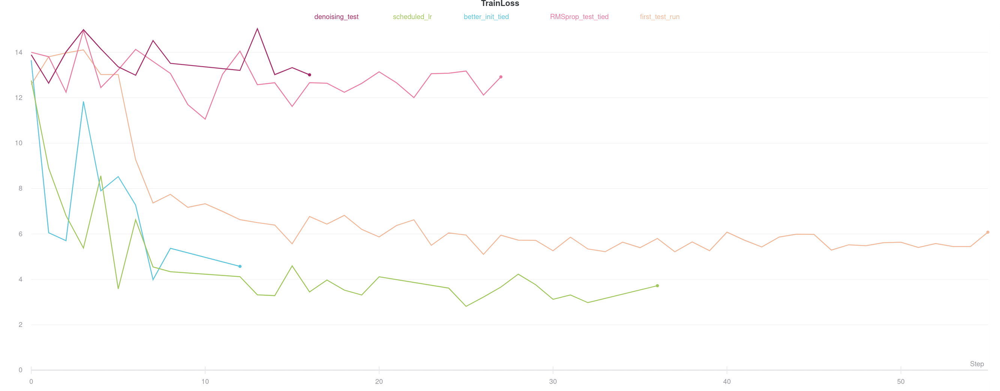
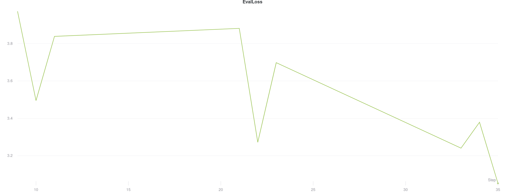

# Deep Collaborative Filtering
In this project a deep neural network is used to create a collaborative filtering
system for movies recommendation.  

## Dataset
These dataset contains metadata for all 45,000 movies listed in the Full MovieLens Dataset,
it was downloaded from [link](https://www.kaggle.com/rounakbanik/the-movies-dataset "kaggle").
The complete datset included a large metadata but for the purposes of this project, only the
ratings of the movies where used since we wanted to learn the latent structured of the
dataset distribution. The datset was a very big sparse matrix with the rating of each user.
## Network architecture
The objective of the neural network was to perform a *model based* collaborative filtering,
for that we used and autoencoder that tried to learn the ratings of the movies that the user
has watched but at the same time, applying the knowledge of ratings of other users to the movies
that have not been watched.
### Loss function
To be able to learn the ratings of movies not seen by the user a loss function of MSE
was applied between the input dataset and the output of the network, but ignoring the indexes
of movies that have not been watched yet. This way the autoencoder was able to learn the codings
of a specific user and create a collaborative relationship with other users.

## Experimentation
The training of the model was performed multiple times although 5 different implementations
can be distinguished.

### first_test_run
This was one of the first succesful runs were the training was very slow and the trianing loss
didn't show any improvement at the end of the training. Later it was concluded that the model
was stuck in a bad local minimum. Due to the high dimensionality of the sparse dataset memory
was a problem, techniques such as pytorch checkpoint were tried but the training speed was
reduced to much.
### RMSprop_test_tied
In this attempt a RMSprop optimizer was used (simple SGD descent was used in the first one). Since
the autoencoder was completly simetrycal we also tied the weights between encoder and decoder. This
optimizer was a really bad choice since the network did not improve in any epoch.
### better_init_tied
After the RMSprop failure, we returned to SGD but improved the weights initialization by using
`nn.init.xavier_uniform_`, this initialization has helped the network to converge much faster.
In the end it seems more stable, so we may needed a learning sheduling techinque to continue reducing the amount of error that is propagated through the network.
### scheduler_lr
In this technique we applied the same network as before but with a scheduled rating, where each
epoch the learning rete was reduced in a factor of 10. This showed to be the best model so far
because it started with a faste convergence and as the epochs passed the error continued lowering.
### denoising_test
As a final test we applied noise to the input data and combined it with the *scheduler_lr* model,
unfortunately this wasn't succesful and only showd that the model required more capacity due
to the extra step (needed to clean the data).   

As of this plot we can see the evaluation loss of the *scheduler_lr*
(we do not visualize others since they do not show prominent results), it is a little bit unstable
at the beginning of each epoch but we can easily see that it continues to lower as training converges. As a curiosity we can observe that the evaluation loss is even lower than the
train loss. 

**Note**: Additional information on the training process and hyperparameters can be found [link](https://app.wandb.ai/polmonroig/mrs?workspace=user-polmonroig "here").

## Further research
After evaluating the model some issues where encountered where a lot of users where
assigned similar movies, this might be due to the distribution of the dataset itself as
it might be biased to specific movies or the nature of the model. Moreover it would be interesting
to train the model with other datasets and compare its performance.

## Requierements and Usage  
To use the project the following requirements are needed, some are just needed for training
such as torch and pandas for the data analysis.
```
pandas~=1.0.4
numpy~=1.18.5
scikit-learn~=0.23.1
torch~=1.5.1
scipy~=1.4.1
```
### Training
As for the training the following parameters must be used
```
usage: train.py [-h] [--denoiser] [--basic] [--tied_weights] [--not_tied] [--n_epochs N_EPOCHS] [--batch_size BATCH_SIZE]
                [--verbose_epochs VERBOSE_EPOCHS] [--lr LR]

optional arguments:
  -h, --help            show this help message and exit
  --denoiser            Use denoiser autoencoder
  --basic               Use basic autoencoder
  --tied_weights        Tie encoder/decoder weights
  --not_tied            Use separate encoder/decoder weights
  --n_epochs N_EPOCHS   Number of epochs for the training loop
  --batch_size BATCH_SIZE
                        Batch size of the training and eval set
  --verbose_epochs VERBOSE_EPOCHS
                        Number of epochs per training verbose output
  --lr LR               Learning rate of the optimizer
```
### Evaluation
The evaluation script is separated with two functionlities, first, the model must
be converted to ONNX format, this enables a faster inference and better compatibility.
After the ONNX model is generated the inference can be done on a scpy sparse matrix.
```
usage: eval.py [-h] [--evaluate] [--generate] [--model MODEL] [--batch_size BATCH_SIZE] [--data DATA]

optional arguments:
  -h, --help            show this help message and exit
  --evaluate            Evaluate a specified model
  --generate            Convert a pytorch model to ONNX
  --model MODEL         Model to convert or evaluate
  --batch_size BATCH_SIZE
                        Batch size of the input data
  --data DATA           Data to evaluate
```
